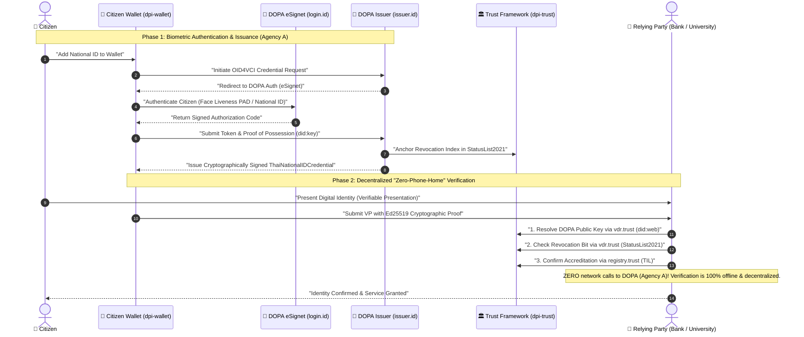

# 🪪 DPI National ID — Sovereign Identity Issuer & Reference Verifier

> **Part of the MOSIP Asia Digital Public Infrastructure (DPI) Suite**  
> **Agency A:** Department of Provincial Administration (DOPA) / National Identity Authority (`*.id.<domain>`)  
> **Lead Engineers:** Mehul (`@thassung`), Sila (`@silanm`)  
> **Target Delivery:** Activity 1.5 under the Bill & Melinda Gates Foundation Ecosystem Grant

---

## 📌 Executive Summary

**DPI National ID** implements the sovereign **Citizen Credential Issuance Authority** for the national identity ecosystem. Operating under the mandate of the **Department of Provincial Administration (DOPA)**, it bridges foundational civil registration (MOSIP IDRepo, IDA, BioSDK) with the decentralized verifiable credential ecosystem (Inji Certify, OID4VCI).

The core focus of this repository is **high-assurance, privacy-preserving credential issuance**. Additionally, to accelerate national adoption across commercial banks, universities, and public sector agencies, this repository includes a standalone **Decentralized Reference Verifier Example** demonstrating how third-party relying parties can verify citizen credentials with **zero phone-home** to DOPA.

---

## 🏛️ Agency A Architecture & Domain Topology

DPI National ID operates under the sovereign `*.id.<domain>` zone (e.g., `id.dpi.ait.ac.th`):

| Endpoint | Ingress FQDN | Component & Role | Protocol / Standards |
|---|---|---|---|
| **Identity Issuer** | `https://issuer.id.<domain>` | Inji Certify (OID4VCI Issuer) | OpenID for Verifiable Credential Issuance (OID4VCI) |
| **Citizen Auth & Face Bio** | `https://login.id.<domain>` | MOSIP eSignet + BioSDK | OIDC / OAuth 2.0 with ISO 30107-3 PAD Face Auth |
| **Citizen Onboarding** | `https://register.id.<domain>` | Lightweight Enrollment Gateway | Multi-factor citizen identity proofing |
| **Reference Verifier** | `examples/verifier/` | Relying Party Example Verifier | W3C VC 2.0, W3C StatusList2021, Decentralized `did:web` |

---

## 🔄 End-to-End Issuance & Verification Lifecycle



---

## 🛡️ The "Zero-Phone-Home" Verification Paradigm

A foundational architectural requirement of modern Digital Public Infrastructure (DPI) is that **issuers must never track citizens across services**:

1. **Surveillance Elimination:** When a citizen verifies their age at a convenience store or opens an account at a commercial bank, DOPA receives **zero network telemetry**. The relying party verifies the credential using public cryptographic keys anchored on `dpi-trust`.
2. **Infinite Scaling & Resiliency:** DOPA's issuance infrastructure does not experience query spikes during national events or bank onboarding drives.
3. **Offline Readiness:** Relying parties with cached VDR public keys and StatusList2021 bitstrings can verify citizens completely air-gapped without Internet connectivity.

---

## 🔍 Standalone Reference Verifier Example

To assist relying parties (banks, universities, hackathons) in implementing decentralized verification, a production-ready, dependency-free reference verifier is bundled in [`examples/verifier/`](examples/verifier/):

```bash
# Run the reference verifier in offline mode using bundled fixtures
cd examples/verifier
python3 verify.py --offline

# Run verification against the live sandbox Trust Framework
python3 verify.py --domain dpi.ait.ac.th --vc fixtures/national-id-vc.json
```

### Verification Capabilities Demonstrated:
* [x] **DID Resolution:** Resolves issuer `did:web` document and extracts Ed25519 public keys.
* [x] **Proof Validation:** Verifies digital signature authenticity and cryptographic key binding.
* [x] **Temporal Validation:** Enforces strict `issuanceDate` and `expirationDate` validity windows.
* [x] **Bitstring Revocation:** Decompresses and evaluates W3C `StatusList2021` byte array bits.
* [x] **Zero Contact:** Validates the entire payload without making a single request to the DOPA issuer.

For implementation instructions, see the [Relying Party Guide](examples/verifier/README.md).

---

## 📦 Deployment & OCI Packaging

DPI National ID is packaged as an OCI Helm chart deployable on sovereign Kubernetes / k3s clusters:

```bash
# Deploy Inji Certify connected to MOSIP identity substrate
helm upgrade --install ait-nationalid ./helm/ait-nationalid \
  -n id-system \
  --create-namespace \
  --set global.domain="dpi.ait.ac.th"
```

### Core Configuration Variables (`issuer/config/certify-dopa.properties`)
* `certify.issuer.id`: `did:web:vdr.trust.dpi.ait.ac.th:issuers:dopa`
* `mosip.esignet.base-url`: `https://login.id.dpi.ait.ac.th`
* `trust.vdr.base-url`: `https://vdr.trust.dpi.ait.ac.th`
* `trust.status-list.url`: `https://vdr.trust.dpi.ait.ac.th/status/status-list-2021.json`

---

## 🗺️ Milestone Roadmap & Project Tracking

All engineering deliverables are tracked on [**Project #14: dpi-sandbox**](https://github.com/orgs/mosip-asia/projects/14):

| Milestone | Target ETA | Issue | Title | Status | Assignees |
|---|:---:|:---:|:---|:---:|:---:|
| **Milestone 1.5.1** | **30 Sep 2026** | **[#1](https://github.com/mosip-asia/dpi-nationalid/issues/1)** | Deploy National ID Credential Issuer (Inji Certify) & Reference Verifier Example | `Ready` | `@thassung`, `@silanm` |
| **Milestone 1.5.2** | **31 Oct 2026** | **[dpi-sandbox#8](https://github.com/mosip-asia/dpi-sandbox/issues/8)** | Dual eSignet Auth (ISO 30107-3 Face PAD + Google OAuth) | `Ready` | `@thassung`, `@bossk` |
| **Milestone 1.5.3** | **31 Dec 2026** | **[dpi-sandbox#14](https://github.com/mosip-asia/dpi-sandbox/issues/14)** | Core Identity Code Freeze & Multi-Tenant Performance Hardening | `Backlog` | Core Team |
| **Milestone 1.5.4** | **30 Jan 2027** | **[dpi-sandbox#19](https://github.com/mosip-asia/dpi-sandbox/issues/19)** | End-to-End Cryptographic Audit Logs & Final Verification | `Backlog` | Core Team |

---

## 📜 Standards Compliance

* **W3C:** [Verifiable Credentials Data Model v2.0](https://www.w3.org/TR/vc-data-model-2.0/)
* **W3C:** [StatusList2021 Revocation](https://w3c-ccg.github.io/vc-status-list-2021/)
* **OpenID Foundation:** [OpenID for Verifiable Credential Issuance (OID4VCI) - Draft 13](https://openid.net/specs/openid-4-verifiable-credential-issuance-1_0.html)
* **ISO / IEC:** ISO 30107-3 Presentation Attack Detection (PAD) Level 1 & 2
* **ETDA / DGA:** Thailand National Verifiable Identity Standards

---

## 📄 License

Licensed under the **Apache License 2.0** — see the [LICENSE](LICENSE) file for details.
